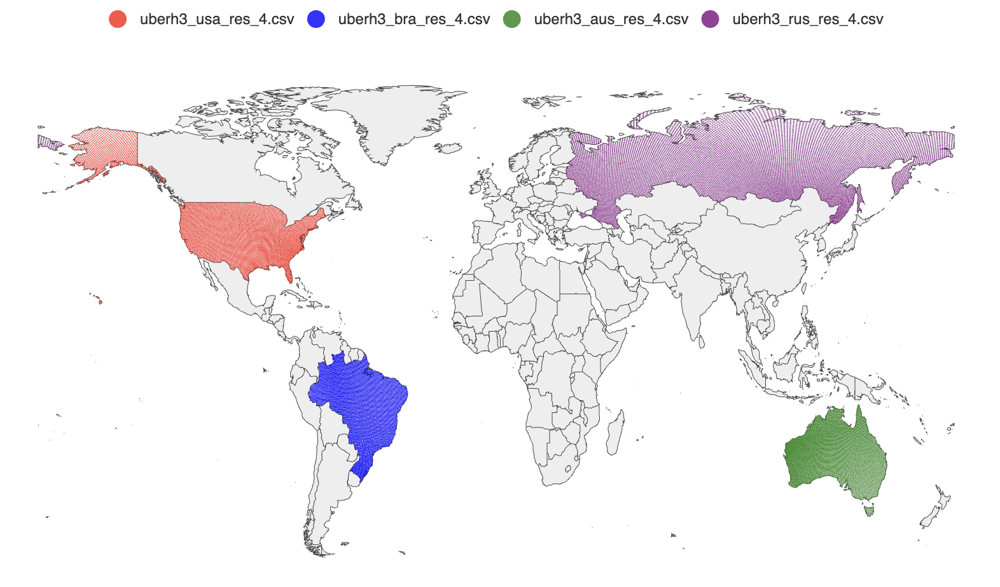

# geodata

geodata is a simple tool to generate UberH3 cellIDs, latitude, and longitude for all countries in the world. It utilizes Natural Earth data for country boundary polygons, then generates all cell IDs within those polygons, writing the results to CSV files. You can also configure resolution for cell generation.

You can visualize the generated results with this tool: https://github.com/nttams/geoplot

